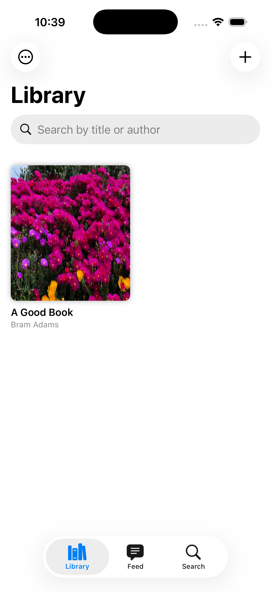
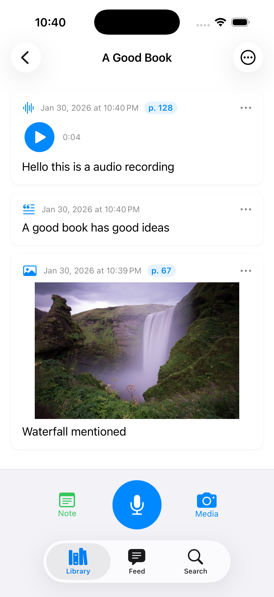
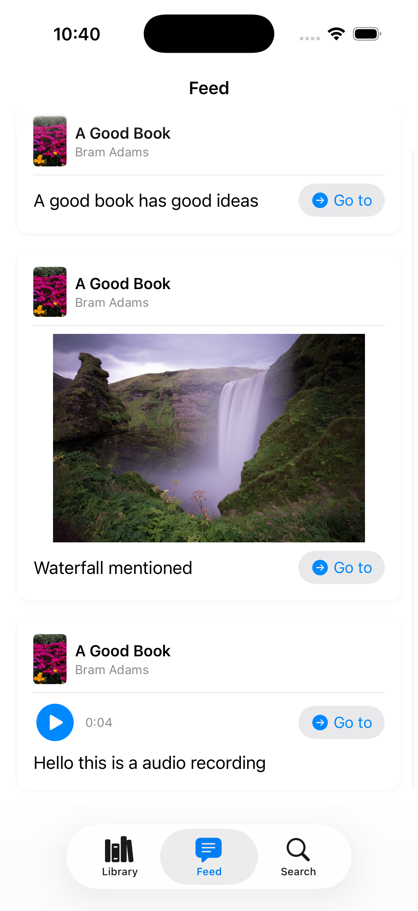
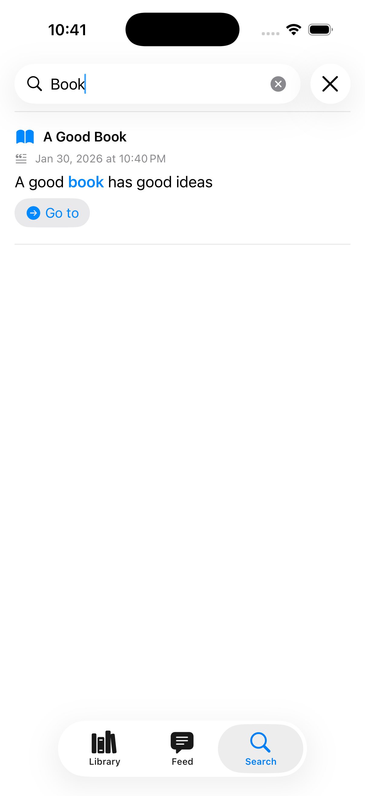

# BookTalk

A reading companion app for iOS that lets you capture thoughts, quotes, and insights as you read — using your voice, camera, or keyboard.

[](https://apps.apple.com/us/app/booktalks/id6758533463)

## Features

### Voice Annotations
- **Widgets (Home + Lock Screen)** - Launch Quick Record from the widget
- **In-app recording** - Record audio annotations inside any book
- **Automatic transcription** - On-device speech recognition, completely private

### Image & Video Annotations
- Take photos of passages, diagrams, or interesting pages
- Import from your photo library
- Add captions for context

### Text Notes
- Quick typed notes with optional page numbers
- Full-text search across all annotations

### Library Management
- Add books manually or scan ISBN barcodes
- Automatic title, author, and cover lookup via Open Library API
- Archive books you've finished

### Feed & Search
- Browse all annotations across all books
- Random shuffle for serendipitous rediscovery
- Full-text search with highlighted matches
- Spotlight integration for system-wide search

## Widgets

BookTalk includes Home Screen and Lock Screen widgets for quick audio capture. Tap the widget to open Quick Record, then choose the book while you record. Recordings are saved to the selected book and transcribed on-device.

## Screenshots

<p float="left">
  
  
  
  
</p>

<p>
  
  
  
  
  
  
</p>

## Requirements

- iOS 16.0+
- Xcode 15.0+
- Swift 5.9+

## Building

1. Clone the repository
```bash
git clone https://github.com/yourusername/BookTalk.git
cd BookTalk
```

2. Open in Xcode
```bash
open BookTalk.xcodeproj
```

3. Build and run on simulator or device

## Tech Stack

- **SwiftUI** - UI framework
- **GRDB.swift** - SQLite database with FTS5 full-text search
- **AVFoundation** - Audio recording and playback
- **Speech** - On-device transcription
- **Vision** - ISBN barcode scanning
- **Core Spotlight** - System search integration
- **WidgetKit** - Home + Lock Screen widgets

## Architecture

```
BookTalk/
├── BookTalkApp.swift          # App entry point
├── ContentView.swift          # Main tab view
├── Database/
│   ├── DatabaseManager.swift  # SQLite + GRDB setup
│   ├── Book.swift             # Book model
│   └── Annotation.swift       # Annotation model + FTS
├── Services/
│   ├── AudioRecorder.swift    # In-app recording
│   ├── AudioPlayer.swift      # Playback
│   ├── TranscriptionService.swift
│   ├── SpotlightService.swift
│   ├── BarcodeScannerService.swift
│   └── BookLookupService.swift
└── Views/
    ├── Library/               # Book grid, add book
    ├── Book/                  # Book detail, annotations
    ├── Feed/                  # All annotations feed
    ├── Search/                # Search interface
    ├── Recording/             # Quick Record flow
    └── Common/                # Shared components
```

## Privacy

BookTalk is designed with privacy in mind:

- **All data stored locally** - No cloud sync, no accounts
- **On-device transcription** - Speech recognition runs entirely on your device
- **No analytics or tracking** - Zero data collection
- **No network requests** except ISBN lookup when adding books

See the full [Privacy Policy](https://www.bramadams.dev/booktalk-privacy-policy/).

## Permissions

| Permission | Usage |
|------------|-------|
| Microphone | Recording voice annotations |
| Camera | Scanning ISBN barcodes, taking photos |
| Photo Library | Adding existing photos/videos |
| Speech Recognition | On-device transcription |

## Contributing

Contributions are welcome! Please feel free to submit a Pull Request.

1. Fork the repository
2. Create your feature branch (`git checkout -b feature/amazing-feature`)
3. Commit your changes (`git commit -m 'Add amazing feature'`)
4. Push to the branch (`git push origin feature/amazing-feature`)
5. Open a Pull Request

## License

This project is licensed under the MIT License - see the [LICENSE](LICENSE) file for details.

## Acknowledgments

- [GRDB.swift](https://github.com/groue/GRDB.swift) - SQLite toolkit for Swift
- [Open Library API](https://openlibrary.org/developers/api) - Book metadata

## Author

**Bram Adams**
- Website: [bramadams.dev](https://www.bramadams.dev)
- Support: bram+support@bramadams.dev
